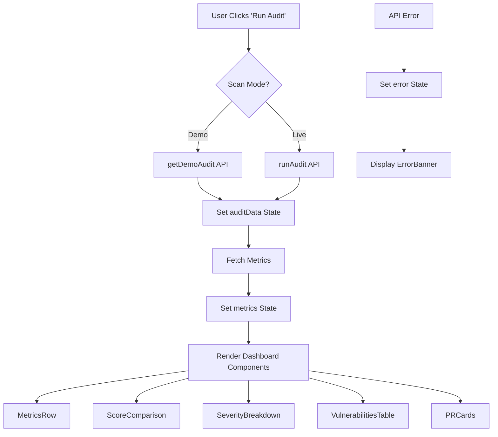

# CodeGuard Dashboard - Architecture Overview

## 🏗️ Component Hierarchy

```
DashboardUI (Main Container)
│
├── Navbar
│   ├── Logo
│   ├── Navigation Links (Dashboard, Reports, Settings)
│   └── API Status Indicator + User Avatar
│
├── Hero
│   ├── Title & Description
│   ├── Scan Mode Toggle (Demo/Live)
│   └── Run Audit Button
│
├── ErrorBanner (Conditional)
│   └── Error Message Display
│
└── Main Grid (Conditional on auditData)
    │
    ├── MetricsRow
    │   ├── Metric Card 1 (Total Issues)
    │   ├── Metric Card 2 (Time Saved)
    │   ├── Metric Card 3 (Cost Savings)
    │   └── Metric Card 4 (Security Score)
    │
    ├── Split Row
    │   ├── ScoreComparison
    │   │   ├── Before Score Ring
    │   │   └── After Score Ring
    │   │
    │   └── SeverityBreakdown
    │       ├── Critical Count
    │       ├── High Count
    │       ├── Medium Count
    │       └── Low Count
    │
    ├── VulnerabilitiesTable
    │   ├── Filter Tabs (All, Critical, High, Medium, Low)
    │   ├── Table Header
    │   └── Expandable Rows
    │       ├── File & Line Number
    │       ├── Issue Type
    │       ├── Severity Badge
    │       ├── Confidence Bar
    │       ├── PR Fix Status
    │       └── Expanded Details (Code, Description, Fix)
    │
    ├── PRCards (Conditional on vulnerabilities)
    │   └── PR Card Items
    │       ├── Vulnerability Info
    │       ├── Priority Badge
    │       ├── Estimated Time
    │       └── Bob Prompt
    │
    └── EmptyState (When no data)
        ├── Icon
        └── Call-to-Action Message
```

---

## 🔄 Data Flow



---

## 📦 State Management

### DashboardUI State

```typescript
{
  loading: boolean; // Audit in progress
  auditData: AuditData | null; // Audit results
  metrics: MetricsData | null; // Performance metrics
  error: string | null; // Error message
  scanMode: "demo" | "live"; // Current scan mode
  lastAudit: string | null; // Last audit timestamp
  apiStatus: ApiStatus; // API health status
}
```

### Key State Transitions

1. **Initial Load** → Check API health → Set `apiStatus`
2. **Run Audit** → Set `loading: true` → Fetch data → Set `auditData` → Set `loading: false`
3. **Error** → Set `error` message → Display `ErrorBanner`
4. **Mode Switch** → Update `scanMode` → Next audit uses new mode

---

## 🎨 Styling Architecture

### Global Styles ([`styles.ts`](dashboard/src/components/styles.ts))

- Base typography (Syne, JetBrains Mono)
- Color system (dark theme)
- Grid layouts
- Card components
- Animations (rowIn, spin, blink)
- Responsive breakpoints

### Component-Specific Styles

Each component includes inline `<style>` tags for:

- Component-specific layouts
- Interactive states (hover, active)
- Animations and transitions
- Responsive adjustments

### Design Tokens

```typescript
SEVERITY_CONFIG = {
  CRITICAL: { color: "#ef4444", bg: "rgba(239,68,68,0.12)" }
  HIGH:     { color: "#f97316", bg: "rgba(249,115,22,0.12)" }
  MEDIUM:   { color: "#eab308", bg: "rgba(234,179,8,0.12)" }
  LOW:      { color: "#6b7280", bg: "rgba(107,114,128,0.12)" }
}
```

---

## 🔌 API Integration

### Endpoints Used

```typescript
// Health Check
GET /health
→ { status: "ok", service: "CodeGuard AI Engine" }

// Demo Audit
GET /api/v1/demo
→ { success: true, data: AuditData, note: "Demo results" }

// Live Audit
POST /api/v1/audit
Body: { files: FileInput[] }
→ { success: true, data: AuditData }

// Metrics
GET /api/v1/metrics
→ { success: true, data: MetricsData }
```

### API Client ([`api.ts`](dashboard/src/lib/api.ts))

- Type-safe interfaces for all API responses
- Centralized fetch functions
- Error handling
- Environment-based URL configuration

---

## 📱 Responsive Breakpoints

```css
/* Mobile First Approach */
Base:        320px - 767px   (Mobile)
Tablet:      768px - 1023px  (Tablet)
Desktop:     1024px - 1399px (Desktop)
Large:       1400px+         (Large Desktop)

/* Key Breakpoint */
@media (max-width: 768px) {
  .split-row {
    grid-template-columns: 1fr;
  }
}
```

---

## 🎯 Component Responsibilities

### DashboardUI

- **Role:** Main orchestrator
- **Responsibilities:**
  - State management
  - API calls
  - Component composition
  - Error handling

### Navbar

- **Role:** Navigation & status
- **Responsibilities:**
  - Display branding
  - Show API status
  - User profile access
  - Navigation links

### Hero

- **Role:** Primary action
- **Responsibilities:**
  - Display title/description
  - Scan mode selection
  - Trigger audit
  - Show loading state

### MetricsRow

- **Role:** Key metrics display
- **Responsibilities:**
  - Show total issues
  - Display time saved
  - Show cost savings
  - Display security score

### ScoreComparison

- **Role:** Score visualization
- **Responsibilities:**
  - Show before/after scores
  - Visual progress rings
  - Score improvement indicator

### SeverityBreakdown

- **Role:** Severity distribution
- **Responsibilities:**
  - Show vulnerability counts by severity
  - Visual bar chart
  - Impact metrics

### VulnerabilitiesTable

- **Role:** Detailed vulnerability list
- **Responsibilities:**
  - Display all vulnerabilities
  - Filter by severity
  - Expandable details
  - Code snippets

### PRCards

- **Role:** Remediation guidance
- **Responsibilities:**
  - Show auto-generated PR suggestions
  - Display Bob prompts
  - Priority indicators
  - Estimated effort

### EmptyState

- **Role:** Initial state
- **Responsibilities:**
  - Guide first-time users
  - Call-to-action
  - Visual placeholder

---

## 🔐 Type Safety

### Core Interfaces

```typescript
interface Vulnerability {
  type: string;
  severity: "CRITICAL" | "HIGH" | "MEDIUM" | "LOW";
  file: string;
  line: number;
  code: string;
  description: string;
  fix_suggestion: string;
  confidence: number;
}

interface AuditData {
  vulnerabilities: Vulnerability[];
  summary: AuditSummary;
  impact: AuditImpact;
  overallScore?: number;
  auditTimestamp?: string;
  remediation?: RemediationData;
}

interface MetricsData {
  total_vulnerabilities: number;
  manual_review_time_minutes: number;
  automated_scan_time_minutes: number;
  time_saved_minutes: number;
  time_saved_hours: number;
  efficiency_improvement: string;
}
```

---

## 🚀 Performance Considerations

### Current Optimizations

- ✅ Component-level code splitting
- ✅ Conditional rendering (avoid unnecessary DOM)
- ✅ CSS-in-JS for scoped styles
- ✅ Efficient state updates with `useCallback`

### Future Optimizations

- [ ] React.memo for expensive components
- [ ] Virtual scrolling for large tables
- [ ] Lazy loading for heavy components
- [ ] Image optimization
- [ ] Bundle size reduction

---

## 🧪 Testing Strategy

### Unit Tests

- Component rendering
- User interactions
- State management
- API integration

### Integration Tests

- Complete user flows
- API error handling
- Mode switching
- Data validation

### E2E Tests

- Full audit workflow
- Demo mode
- Live API mode
- Export functionality

---

## 📊 Component Metrics

| Component            | Lines of Code | Complexity | Reusability |
| -------------------- | ------------- | ---------- | ----------- |
| DashboardUI          | ~150          | High       | Low         |
| Navbar               | ~100          | Low        | High        |
| Hero                 | ~200          | Medium     | Medium      |
| VulnerabilitiesTable | ~365          | High       | Medium      |
| MetricsRow           | ~150          | Medium     | High        |
| ScoreComparison      | ~120          | Medium     | High        |
| SeverityBreakdown    | ~100          | Low        | High        |
| PRCards              | ~150          | Medium     | Medium      |
| EmptyState           | ~50           | Low        | High        |
| ErrorBanner          | ~50           | Low        | High        |

---

## 🔄 Future Architecture Improvements

### State Management

Consider implementing Zustand or Jotai for:

- Global state management
- Persistent filters
- User preferences
- Audit history

### Component Library

Extract reusable components:

- Button variants
- Card layouts
- Badge components
- Loading states
- Modal dialogs

### Routing

Add Next.js routing for:

- `/dashboard` - Main dashboard
- `/reports` - Historical reports
- `/settings` - User settings
- `/vulnerability/:id` - Detail view

---

**Last Updated:** 2026-05-02  
**Version:** 1.0
